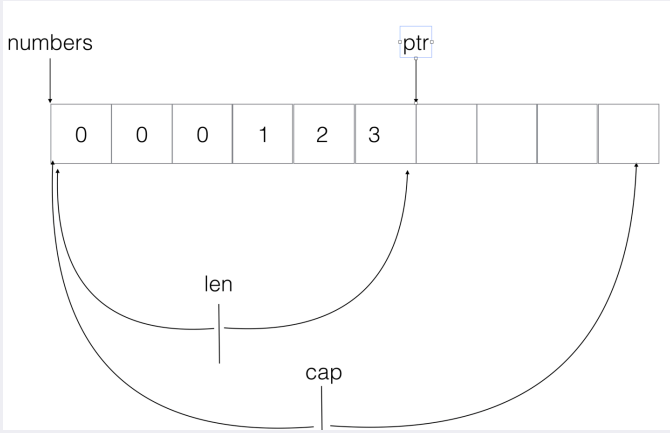
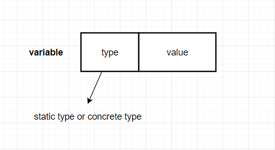
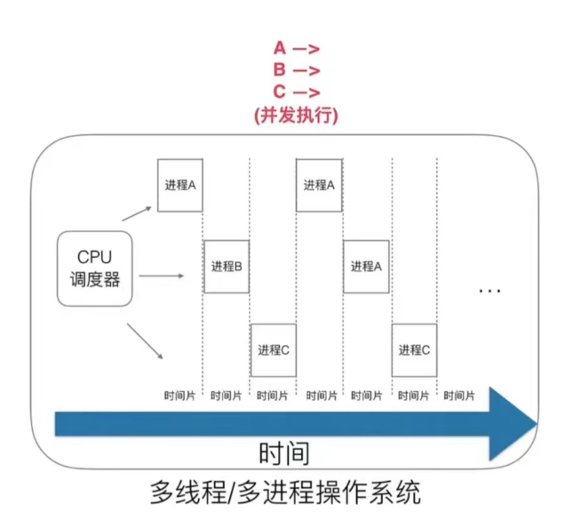
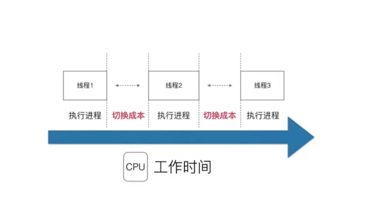
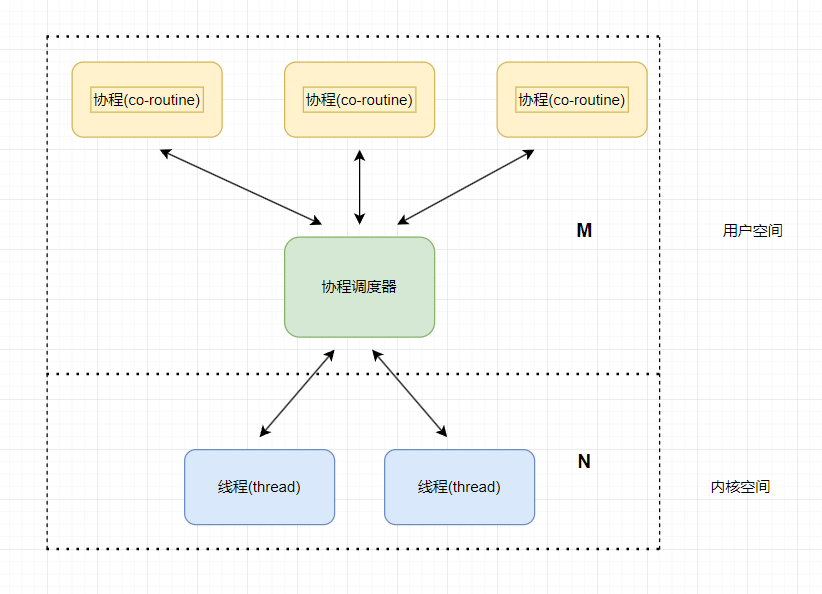
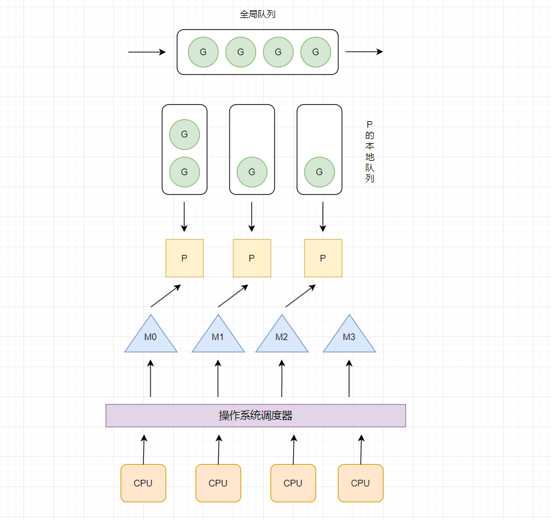
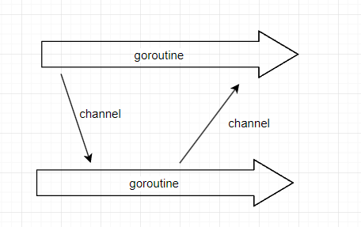
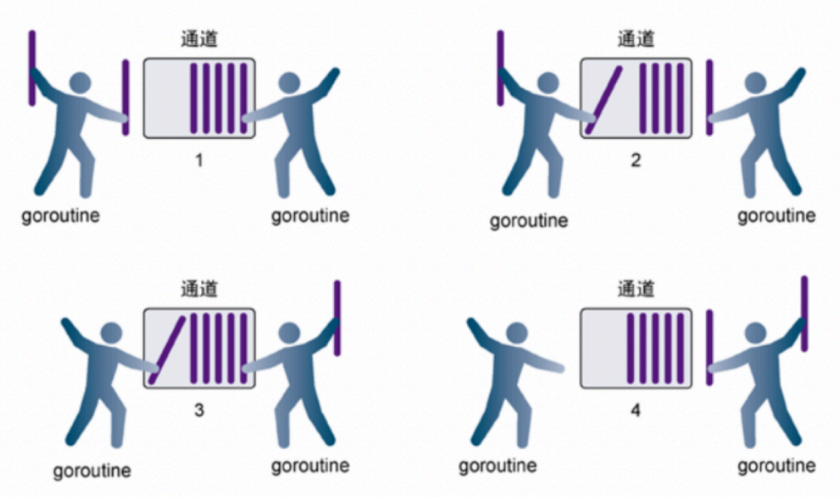

## 快速上手Go语言

### hello world

```go
package main //当前程序的包名
//导入多个包
import (
	"fmt" 
	"time"
)
//main函数
func main() {
	time.Sleep(1 * time.Second)
	fmt.Println("hello Go!")
}
```

- 程序入口 main包下的main函数

  - 第一行代码**package main**定义了包名。你必须在源文件中非注释的第一行指明这个文件属于哪个包，如：package main。package main表示一个可独立执行的程序，每个 Go 应用程序都包含一个名为 main 的包。
  - **import "fmt"**告诉 Go 编译器这个程序需要使用 fmt 包（的函数，或其他元素），fmt 包实现了格式化 IO（输入/输出）的函数。
  - **func main()**是程序开始执行的函数。main 函数是每一个可执行程序所必须包含的，一般来说都是在启动后第一个执行的函数（如果有 init() 函数则会先执行该函数）。

- 导入多个包的简洁语法

- 分号可加可不加 （最好别加）

- 花括号不换行

- 程序编译 ： `go build hello.go`

  运行 ： `./hello`

- go run 表示 直接编译go语言并执行应用程序，一步完成  `go run hello.go`  

### 变量声明

````go
package main

import "fmt"

func main() {
	fmt.Println("============声明单个变量===========")
	//1. 声明不赋值
	var a int
	fmt.Printf("type of a = %T:,value of b = %d\n", a, a)

	//2. 声明并赋值
	var b int = 10
	fmt.Printf("type of b = %T:,value of b = %d\n", b, b)

	//3. 类型推断
	var c = "Go"
	fmt.Printf("type of c = %T:,value of c = %s\n", c, c)

	//4. 省去var，自动匹配  最常用  := 只能声明在局部变量，不能声明全局变量
	d := "cjp"
	//d := 100  type of c = int:,value of c = %!s(int=100) ???
	fmt.Printf("type of d = %T:,value of c = %s\n", d, d)

	fmt.Println("============声明多个变量===========")
	var aa, bb int = 100, 200
	fmt.Println("aa =",aa,"bb =",bb) 

	var cc, dd = 300, "陈坚鹏"
	fmt.Println("cc =",cc,"dd =",dd) 

	//多行的多变量声明  一般用于声明全局变量
	var(
		ee int = 100;
		ff = "习近平"  // ff string = "习近平"
	)
	fmt.Println("ee =",ee,"ff =",ff) 
    
    //_表示变量7的赋值被废弃，变量 _  不具备读特性
	_, value := 7, 5
	fmt.Println(value) 
}

````

- 最常用的是  `name := "cjp"` ，其他的就是 `var + 变量名 + 变量类型  ` , 其中类型可以省略

- 全局变量要用`var`声明

- 不允许在同一个作用域内声明同名的局部变量。在同一个作用域内，每个变量名必须是唯一的，否则会导致编译错误。

  -  c++ 和go是允许在某个作用域中声明一个变量时，该作用域下的更低层级的作用域可以声明同名变量。而java这么做编译不通过 。

    C++  正常

    ```c++
    #include<iostream>
    int main() {
        int a = 101;
        if(a > 100) {
            int a = 99;
            std::cout<<a<<std::endl;
        }
        
        // int a = 1009;  这样就肯定不行
    }
    ```

    java   编译出错

    ```java
    package variable;
    
    public class Test {
        public static void main(String[] args) {
            int a = 101;
            if(a > 100) {
                int a = 99; //Duplicate local variable a
                System.out.println(a);
            }
        }
    }
    ```

    go   正常

    ```Go
    package main
    
    import "fmt"
    
    func main() {
    	test := 101
    	if test > 100 {
    		//var test = 101
    		test := 100
    		fmt.Print(test)
    	}
        
        // test := 1009;  这样也肯定不行
    }
    ```

    

### 常量

```go
package main

import "fmt"

func main() {
	//常量的定义
	const length int = 100
	const another = 9
	fmt.Println("length =",length,"another =",another)
	fmt.Println("BEIJING =",BEIJING,"SHANGHAI =",SHANGHAI)
	fmt.Println("SUZHOU =",SUZHOU,"NANJING =",NANJING)
	fmt.Println("JIEYANG =",JIEYANG,"QINGDAO =",QINGDAO)
	fmt.Println("a =",a,"b =",b,"c =",c,"d =",d)
	fmt.Println("e =",e,"f =",f,"g =",g,"h =",h)
}

//const来定义枚举类型
const (
	BEIJING = 0
	SHANGHAI = 1
	SHENZHEN = 2
	GUANGZHOU = 3
)

//关键字 iota 每行的iota都会累加1，第一行的iota默认值是 0 
const (
	// 等价于 0 1 2 3
	SUZHOU = iota
	NANJING
	TAIPEI
	CHENGDU
)

const (
	// 等价于 0 10 20 30
	JIEYANG = iota * 10
	QINGDAO
	SHANTOU
	FUJIAN
)

const (
	//a = 1,b = 2,c = 2,d = 3
	a,b = iota + 1,iota + 2
	c,d 

	//e = 20,f = 40,g = 30,h = 60
	e,f = iota * 10,iota * 20
	g,h
)
```

- `iota` 关键字的使用，只能在const里出现

### 流程控制语句

- if 语句

  - 普通的`if - else if - else` 不用加括号就是

  - 带有初始化语句的 if 语句,在条件判断之前，可以执行一个初始化语句。

    ```go
    package main
    
    import "fmt"
    
    func main() {
        // 基本的 if 语句
        x := 10
        if x > 5 {
            fmt.Println("x 大于 5")
        }
    
        // 带有 else 分支的 if 语句
        y := 3
        if y > 5 {
            fmt.Println("y 大于 5")
        } else {
            fmt.Println("y 不大于 5")
        }
    
        // 带有初始化语句的 if 语句
        if z := 7; z > 5 {
            fmt.Println("z 大于 5")
        }
    }
    ```

- 循环控制语句

  在 Go 语言中，有两种主要的循环控制语句：`for` 循环和 `range` 循环。

  - 普通的for循环语句

    `for` 循环是 Go 语言中基本的循环结构，它有三种形式：

    **a. 基本形式：**

    ```go
    for 初始化语句; 条件表达式; 后置语句 {
        // 循环体
    }
    ```

    ```go
    for i := 0; i < 5; i++ {
        // 循环体
    }
    ```

    **b. 类似 while 循环：**

    ```go
    for 条件表达式 {
        // 循环体
    }
    ```

    ```go
    count := 0
    for count < 5 {
        // 循环体
        count++
    }
    ```

    **c. 无限循环：**

    ```go
    for {
        // 无限循环体
    }
    ```

    ```go
    for {
        fmt.Println("无限循环")
    }
    ```

  - `range`关键字

    `range` 循环用于迭代数组、切片、字符串、map 等集合类型的元素。它返回两个值，第一个是索引（或键），第二个是元素的值。

    ```go
    for 索引, 值 := range 集合 {
        // 循环体
    }
    ```

    ```go
    numbers := []int{1, 2, 3, 4, 5}
    for index, value := range numbers {
        fmt.Printf("Index: %d, Value: %d\n", index, value)
    }
    ```

### 函数

#### 普通函数

```go
package main

import "fmt"

func main() {
	fmt.Println("return ",myfunc1("p1","p2"))
	// fmt.Println("return ",myfunc2("p1","p2")) multiple-value myfunc2("p1", "p2") (value of type (int, int)) in single-value context
	result1,result2 := myfunc2("p1","p2")
	fmt.Println("return ",result1,result2)

	result3,result4 := myfunc3("p1","p2")
	fmt.Println("return ",result3,result4)

	result5,result6 := myfunc4("p1","p2")
	fmt.Println("return ",result5,result6)
}

// 定义函数 func关键字
func myfunc1(a string, b string) int {
	fmt.Printf("myfunc1 形参列表：%s %T,%s %T ",a,a,b,b)  
	return 77
}

//返回多个值
func myfunc2(a string, b string) (int,int) {
	fmt.Printf("myfunc2 形参列表：%s %T,%s %T ",a,a,b,b)
	return 66,77
}

//返回多个值，并给返回值命名
func myfunc3(a string, b string) (r1 int,r2 int) {
	fmt.Printf("myfunc3 形参列表：%s %T,%s %T ",a,a,b,b)
	//r1 r2 作为两个局部变量，有默认值
	r1 = 666
	r2 = 777
	return 
}

//返回多个值，并给返回值命名，并且多个返回值的类型相同
func myfunc4(a string, b string) (r1 ,r2 int) {
	fmt.Printf("myfunc4 形参列表：%s %T,%s %T ",a,a,b,b)
	//r1 r2 作为两个局部变量，有默认值，在这里会返回0
	return 
}
```

- 可以给返回值指定名字，方便进行一些复杂操作后得到返回值
- 允许给返回值变量赋值后还是返回了其他值

#### init函数

```go
package main
/*搞不明白  它会从goroot去找，所以我得把go_code 复制到std( (D:\sdk_golang\go1.21.5\src\)里，否则报错：
PS D:\go-project\src\go_code\go-learning\init_> go run main.go
main.go:5:2: package go_code/go-learning/init_/lib1 is not in std (D:\sdk_golang\go1.21.5\src\go_code\go-learning\init_\lib1)
main.go:6:2: package go_code/go-learning/init_/lib2 is not in std (D:\sdk_golang\go1.21.5\src\go_code\go-learning\init_\lib2)
*/
import (
	"fmt"
	"go_code/go-learning/init_/lib1"
	"go_code/go-learning/init_/lib2"
)

func main() {
	lib1.Lab1Test()
	lib2.Lab2Test()
}

func init() {
	fmt.Println("main init...")
}

```

golang里面有两个保留的函数：init函数（能够应用于所有的package）和main函数（只能应用于package main）。这两个函数在定义时不能有任何的参数和返回值。

- init 函数可在package main中，可在其他package中，可在同一个package中出现多次。

- main 函数只能在package main中。

- 虽然一个package里面可以写任意多个init函数，但这无论是对于可读性还是以后的可维护性来说，我们都强烈建议用户在一个package中每个文件只写一个init函数。

  go程序会自动调用init()和main()，所以你不需要在任何地方调用这两个函数。每个package中的init函数都是可选的，但package main就必须包含一个main函数。

  程序的初始化和执行都起始于main包。

  如果main包还导入了其它的包，那么就会在编译时将它们依次导入。有时一个包会被多个包同时导入，那么它只会被导入一次（例如很多包可能都会用到fmt包，但它只会被导入一次，因为没有必要导入多次）。

  当一个包被导入时，如果该包还导入了其它的包，那么会先将其它包导入进来，然后再对这些包中的包级常量和变量进行初始化，接着执行init函数（如果有的话），依次类推。

  等所有被导入的包都加载完毕了，就会开始对main包中的包级常量和变量进行初始化，然后执行main包中的init函数（如果存在的话），最后执行main函数。下图详细地解释了整个执行过程：

  

#### import 导包

- 给包取一个别名，而且是匿名，无法使用当前包的方法，但是会执行当前包内部的`init()`方法

```go
import (
    "fmt"
    _ "GolangTraining/InitLib1"
    _ "GolangTraining/InitLib2"
)
```

- 给包取别名 可以通过`myLib2.Println()`来直接调用

```go
import (
    myLib2 "fmt"
     "GolangTraining/InitLib2"
)
```

- 导入包中的全部方法，导入到当前本包的作用域中，fmt包中的全部方法可以直接使用API来调用,不需要通过`fmt.Println()`

```go
import (
    . "fmt"
)
```

#### defer关键字

defer语句被用于预定对一个函数的调用。可以把这类被defer语句调用的函数称为延迟函数。

defer作用：

- 释放占用的资源
- 捕捉处理异常
- 输出日志

```go
package main

import "fmt"

func main() {
	defer fmt.Println("main end1") 
    //在当前函数生命周期结束之后会被调用，有点类似析构函数,defer后面跟的就是让这个函数（defer所在的那里）
    //结束之前做的事，有多个defer以栈的形式，先进后出
	defer fmt.Println("main end2") 

	fmt.Println("main::hello go1")
	fmt.Println("main::hello go2")
}
```

return会先与defer执行：

```go
package main

import "fmt"

func return_func() int{
	fmt.Println("return end.")
	return 1
}

func defer_func() {
	fmt.Println("defer end.")
}

func test() int {
	defer defer_func()
	return return_func() 
}
func main()  {
	test()
}

//out:
return end.
defer end.
```

### slice 切片

#### 数组

```go
package main

import "fmt"

func main() {
	//定义数组

	//固定数组长度
	var myArray [4]int
	for i, v := range myArray {
		v = i + 1
		fmt.Println("index:",i,"value:",v)
	}

	fmt.Println("========================")

	myArray2  := [5]int {1,2,3}
	var myArray3 = [5]int {0,1,2,3,4}; //最好不要这样写
	printArray(myArray2)
	fmt.Println("========================")
	printArray(myArray3)
}

//将固定数组作为参数传递，类型要匹配，这里就接收不了[4]int
//而且传递固定数组是值拷贝
func printArray(myArray [5]int) {
	for i, v := range myArray {
		fmt.Println("index:",i,"value:",v)
	}
}
```

- 固定⻓度的数组在传参的时候， 是严格匹配数组类型的
- 固定数组作为形参传递是值拷贝

#### 动态数组 (slice)

```go
package main

import "fmt"

func main() {
	array := []int{1, 2, 3, 4}
	printSlice(array)
}

func printSlice(array []int) {
	for _, value := range array {
		fmt.Println(value)
	}
}
```

- 动态数组在传参上是引⽤传递，⽽且不同元素⻓度的动态数组他们的形参是⼀致

**声明切片的方式：**

```go
package main

import "fmt"

func main() {
	//声明slice是一个切片，并且初始化
	slice1 := []int{1, 2, 3, 4}
	printSlice(slice1)

	//声明切片但没有分配空间
	var slice2 []int
	//fmt.Println(slice2[0]) //数组越界错误

	var slice3 []int = make([]int, 3)
	fmt.Println(slice3[0]) //分配空间
 
	//省略var  最常用
	slice4 := make([]int,3)
	fmt.Println(slice4[0])

	//判断空切片
	if slice2 == nil {
		fmt.Println("slice2是一个空切片")
	} else {
		fmt.Println("slice2有空间")
	}
}

func printSlice(array []int) {
	for _, value := range array {
		fmt.Print(value," ")
	}
	fmt.Print("length :",len(array))
}
```
**切片的基本操作**
- 扩容 append
  
  - 利用append()函数在slice末尾追加元素。append会返回一个新的slice
  ```go
  func main() {
	slice := make([]int,3, 3)
	fmt.Println("slice长度：",len(slice),"slice容量：",cap(slice))

	//在slice末尾追加一个元素
	slice = append(slice, 1)
	//fmt.Println(append(slice, 1))
	fmt.Println("slice长度：",len(slice),"slice容量：",cap(slice))

	//out；
	// slice长度： 3 slice容量： 3
	// slice长度： 4 slice容量： 6
	}
	```
	- 当slice的容量满的时候，底层会自动开辟空间，新开辟的大小就是上次的容量，相当于扩容一倍
- 截取
  ```go
  func main() {
	slice := []int{0, 1, 2, 3, 4}
	//[lower-bound:upper-bound)   这样新切片的长度 =  upper-bound - lower-bound
	part1 := slice[1:3]
	fmt.Println(part1)

	//[0,2)
	part2 := slice[:3]
	fmt.Println(part2)

	//[1,len(slice))
	part3 := slice[1:]
	fmt.Println(part3)

	//[0,len(slice)) 截取全部
	part4 := slice[:]
	fmt.Println(part4)
	
	//这样对slice进行截取后，part和原来的slice还是指向同一块内存空间，只是它们维护的头尾指针不同
	//对slice[0]进行修改 , part[0]也会跟着改变
	slice[0] = 999
	fmt.Println(slice)
	fmt.Println(part2)

	//要实现slice的深拷贝，使用copy(new,old)
	newSlice := make([]int,len(slice))
	copy(newSlice,part3)
	fmt.Println(slice)
	fmt.Println(newSlice)
	}
	```
	- 对slice进行截取后，part和原来的slice还是指向同一块内存空间，只是它们维护的头尾指针不同
	- 要实现slice的深拷贝，使用copy(new,old)

### map

#### 定义map
```go
func main() {
	//var myMap map[string]string = make(map[string]string, 10)
	var myMap map[string]string
	fmt.Print(myMap == nil,"\n")

	//var m = make(map[string]string, 10)
	//也可以不指定大小   
	m := make(map[string]string) 
	m["java"] = "wife"
	m["go"] = "lover"
	fmt.Println(m)

	//声明的同时顺便初始化值，就不需要make分配空间了
	m3 := map[string]string {
		"wife: " : "java",
		"lover" : "go",
		"anotherLover" : "python",
	}

	fmt.Println(m3)
}
```
#### 使用map进行基础的增删改查
```go
func main() {
	cityMap := make(map[string]string)
	fmt.Println(cityMap)

	//添加
	cityMap["China"] = "Bejing"
	cityMap["Japan"] = "Tokoy"
	fmt.Println(cityMap)

	//遍历
	for key , value := range cityMap {
		fmt.Println("key",key,":","value",value)
	}

	//删除 delete关键字  传入key
	delete(cityMap,"Japan")
	fmt.Println(cityMap)

	//修改
	cityMap["China"] = "HuiLai"
	printMap(cityMap)

	//拷贝map
	m4 := make(map[string]string)
	for key, value := range cityMap {
		m4[key] = value
	}
	fmt.Println("\n",m4)
}

//使用map进行传参，引用传递
func printMap(cityMap map[string]string) {
	for key , value := range cityMap {
		fmt.Print("key = ",key," value = ",value)
	}
}
```
- 使用map进行传参，是引用传递
- 拷贝map可以通过遍历逐一赋值到新的map当中

### 面向对象
#### 类
- 定义类：通过struct + func相互绑定来定义类
  - struct的定义：
	```go
	//type 关键字  给数据类型取一个别名
	type myInt int

	//定义结构体
	type Book struct {
		title string
		price myInt 
		}
	```
  	将结构体当作形参进行传递时，有值传递和引用传递两种方式
	```go
	//结构体作形参
	//值传递
	func changeBook1(book Book) {
		book.title = "Golang"
	}
	//引用传递
	func changeBook2(book *Book) {
		book.title = "Golang"
	}   
	```
  - 与func绑定：
	```go
		/*
	func (this Book) Show() {
		fmt.Println(this)
	}

	func (this Book) GetTitile() string {
		return this.title
	}

	func (this Book) SetTitile(title string) {
		
		this.title = title
	}
	*/

	//像上面那样写this指向的是调用该方法的对象的一个副本
	//要加个*,才是指向该对象
	func (this *Book) Show() {
		fmt.Println(this)
	}

	func (this *Book) GetTitile() string {
		return this.title
	}

	func (this *Book) SetTitile(title string) {
		this.title = title
	}

	func main() {
		//创建一个对象
		book := Book{title: "java",price: 100}
		fmt.Println("title:",book.GetTitile())
		book.Show()
	}
	```
  - go中的对象封装是基于包进行封装的。而类的访问权限是通过结构体，字段或者方法的首字母是否大小写来决定的。
	- 大写：对包外部可见，其它包也可以访问
	- 小写：对包外部不可见，只能在本包访问
#### 继承
定义父类和子类的基本语法：
```go
//定义一个父类
type Person struct {
	name string
	age int
}

func (this *Person) Walk() {
	fmt.Println("Person walk...")
}

func (this *Person) Talk() {
	fmt.Println("Person talk...")
}

//定义子类
type Student struct {
	Person
	id int
}

//子类可以重写父类方法
func (this *Student) Walk() {
	fmt.Println("Student Walk...")
}

//扩展新的方法
func (this *Student) Eat() {
	fmt.Println("Student Eat...")
}
```
声明子类：
1. `s := Student{Person{name:"cjp",age : 20},1001}`
2. 也可以这样写:
 ```go
	var s Student
	s.name = "cjp"
	s.age = 20
	s.id = 1001
 ```
- go当中的继承没有那么多权限

#### 多态 interface
**go语言通过接口实现多态的特性。**
- 定义一个接口（本质是一个指针）
	```go
	//接口，本质是一个指针
	type Animal interface{
		Sleep()
		GetColor() string
		GetType() string
	}
	```

- 定义类实现该接口（重写接口的所有方法）
	```go
	//只要重写了这个接口的所有类，就可以用接口类型的指针指向该类
	//猫类
	type Cat struct {
		color string
		the_type string
	}
	func (this *Cat) Sleep() {
		fmt.Println("小猫老弟在睡觉...")
	}

	func (this *Cat) GetColor() string {
		return this.color
	}

	func (this *Cat) GetType() string {
		return this.the_type
	}
	```
- 这样就完成了多态的设计，可以使用接口类型的指针指向实现改接口的类的对象,通过动态绑定机制完成不同的功能
	```go
	//使用接口类型作为形参
	func showAnimal(animal Animal) {
		fmt.Println(animal.GetColor(),animal.GetType())
		animal.Sleep()
	}

	func main() {
		//var animal Animal //接口类型的指针
		var cat Animal = &Cat{"黄色","小猫"}
		showAnimal(cat)

		var dog Animal = &Dog{"快乐","小狗"}
		showAnimal(dog)
	}
	```

**通用万能类型 : 空接口 interface{}**
- 有点像java里的Object类。可以使用`inteface{}`类型接收任意类型的变量
	```go
	package main

	import "fmt"

	func myFunc(arg interface{}) {
		fmt.Println("myFunc arg:",arg)
	}

	func main() {
		myFunc(666)
		myFunc("cjp")
	}
	```
- go提供了**类型断言机制** 用来判断引用的底层数据类型（arg的具体类型）
  ```go
	func myFunc(arg interface{}) {
		fmt.Println("myFunc arg:",arg)
		value , ok := arg.(string)
		if ok {
			fmt.Println("arg:",value,"的类型是string")
		}
	}
  ```


**go语言的变量组成**

<br>
每个变量都由这两部分组成，可以表示为一个pair数据结构:`pair<type,value>`。将变量赋值给另一个变量(可以相互兼容转换吗，比如string -> interface{})的过程中，这个pari是不可变的。
```go
type Reader interface {
	ReadBook()
}

type Writer interface {
	WriteBook()
}

type Book struct {
}

func (this *Book) ReadBook() {
	fmt.Println("Read a book")
}

func (this *Book) WriteBook() {
	fmt.Println("Write a book")
}

func main() {
	//book : pair<type : Book , value : Book{}地址>
	book := &Book{}

	//r : pair<type:,value:>  未确定
	var r Reader
	r = book  //r : pair<type : Book , value : Book{}地址>
	r.ReadBook()

	//w : pair<type:,value:>  未确定
	var w Writer
	w = book //w : pair<type : Book , value : Book{}地址>
	w.WriteBook()

	w = r.(Writer) //此处的断言能成功，因为 w , r这两个变量的pair中的type是一致的
}
```
### 反射
Go 语言的反射机制是一种在运行时检查变量和数据结构类型的机制。反射的功能允许程序在运行时检查类型信息、获取变量的值、修改变量的值，以及调用变量的方法。Go 的反射包是 reflect。

反射主要涉及到 `reflect` 包中的 `Type` 和 `Value` 类型，分别用于表示类型信息和值信息。以下是一些基本的反射操作：

1. **获取类型信息（Type）：**

    使用 `reflect.TypeOf()` 函数可以获取变量的类型信息。例如：

    ```go
    package main

    import (
        "fmt"
        "reflect"
    )

    func main() {
        var num int
        fmt.Println(reflect.TypeOf(num))  // 输出 int
    }
    ```

2. **获取值信息（Value）：**

    使用 `reflect.ValueOf()` 函数可以获取变量的值信息。例如：

    ```go
    package main

    import (
        "fmt"
        "reflect"
    )

    func main() {
        var num int = 42
        value := reflect.ValueOf(num)
        fmt.Println(value.Int())  // 输出 42
    }
    ```

3. **修改变量的值：**

    使用 `reflect.Value` 的 `Elem()` 方法可以获取指向变量的指针，从而修改变量的值。例如：

    ```go
    package main

    import (
        "fmt"
        "reflect"
    )

    func main() {
        var num int = 42
        value := reflect.ValueOf(&num).Elem()
        value.SetInt(100)
        fmt.Println(num)  // 输出 100
    }
    ```

4. **遍历结构体字段和方法：**

    使用 `reflect.Type` 的 `NumField()` 和 `Field()` 方法可以遍历结构体的字段，而使用 `reflect.Type` 的 `NumMethod()` 和 `Method()` 方法可以遍历类型的方法。例如：

    ```go
    package main

    import (
        "fmt"
        "reflect"
    )

    type Person struct {
        Name string
        Age  int
    }

    func (p Person) SayHello() {
        fmt.Println("Hello, I'm", p.Name)
    }

    func main() {
        p := Person{"Alice", 25}

        // 遍历结构体字段
        t := reflect.TypeOf(p)
        for i := 0; i < t.NumField(); i++ {
            field := t.Field(i)
            fmt.Println(field.Name, field.Type)
        }

        // 遍历结构体方法
        for i := 0; i < t.NumMethod(); i++ {
            method := t.Method(i)
            fmt.Println(method.Name, method.Type)
        }
    }
    ```
### 结构体标签
结构体标签（Struct Tags）是结构体字段上的元数据，通常用于在运行时通过反射机制获取字段的信息。结构体标签是写在字段的后方，由反引号（`）括起来的字符串。结构体标签是一种为结构体字段添加元数据的灵活机制，它允许在运行时通过反射机制获取额外的信息。
【ps: 作用有点像java的注解】
- **基本使用**
	```go
	type resume struct {
		Name string `info:"name" doc:"你的名字"`
		Sex  string `info:"sex"`
	}

	func findTag(str interface{}) {
		t := reflect.TypeOf(str).Elem()

		for i := 0; i < t.NumField(); i++ {
			tagInfo := t.Field(i).Tag.Get("info")
			tagDoc := t.Field(i).Tag.Get("doc")
			fmt.Println("info: ",tagInfo,"doc: ",tagDoc)
		}
	}

	func main() {
		var r resume
		findTag(&r)
	}
	```
- **应用案例 ：将struct转为json**
  ```go
  import (
	"encoding/json"
	"fmt"
	)

	//给字段添加元数据，以便在运行时进行解释和处理。很像java的注解
	type Movie struct {
		Title  string   `json:"title"`
		Year   int      `json:"year"`
		Price  int      `json:"rmb"`
		Actors []string `json:"actors"`
	}

	func main() {
		movie := Movie{"果宝特攻", 2002, 20, []string{"甘蔗精", "苹果精", "菠萝精"}}

		//编码，将struct -> json
		jsonStr , err := json.Marshal(movie)
		if err != nil {
			fmt.Println("Json marshal error",err)
			return
		}

		fmt.Printf("jsonStr = %s\n",jsonStr)
	}
  ```
### goruntine 协程
#### 进程相关知识
**多线程/进程操作系统：**

<br>
问题：

<br>
进程/线程的数量越多，切换成本就越大，也就越浪费CPU的性能。多线程随着同步竞争，开发设计也变得越来越复杂。

**go语言的调度器**
在 Go 语言中，goroutine 的调度采用了一种类似轮询调度的方式。Go 运行时（runtime）使用了称为 M:N 调度的模型，其中 M 个 goroutine 可以在 N 个操作系统线程上运行。goroutine 通过 Go 运行时的调度器进行管理，而不是直接依赖于底层的操作系统线程。
 M:N 调度模型：<br>

go的协程调度器的设计与处理策略：
将co-routine => goroutine  减少了协程的内存大小，同时可以对goroutine进行灵活调度。
**GMP模型：**


> 在 Go 语言中，GMP 指的是 Goroutine、M（Machine）、P（Processor），这是 Go 运行时系统的关键组件。GMP 模型用于管理和调度 Goroutine，以实现高效的并发执行。
> 1. **Goroutine (G)**: `Goroutine` 是 Go 语言中的轻量级线程，它由 Go 运行时环境管理。`Goroutine` 是并发执行的基本单位，它相比于传统的线程更轻量，可以高效地创建和管理大量的并发任务。
> 2. **Machine (M)**: `Machine` 是物理或虚拟的执行线程，它负责执行 `Goroutine`。`M` 的数量可以根据系统的 CPU 核心数量动态调整。每个 `M` 都有一个本地的调度队列，其中包含要执行的 `Goroutine`。
> 3. **Processor (P)**: `Processor` 是逻辑处理器，负责将 `M` 与 `G` 进行关联。`P` 的数量决定了系统中可以并发执行的 `Goroutine` 的数量。每个 `P` 包含一个调度器，用于选择要运行的 `M`，并从 `M` 的本地队列中选择 `Goroutine`。
> GMP 模型的关键思想是将 `Goroutine` 与底层的执行线程 `M` 解耦，以充分利用系统资源。当一个 `Goroutine` 阻塞时，`M` 可以继续执行其他 `Goroutine`，而不会阻塞整个线程。这种设计提高了并发执行的效率。
> 
>GMP 模型的工作流程如下：
>1. 初始时，系统会创建一个 `P`（`P` 的数量可以通过 `GOMAXPROCS` 环境变量进行设置）。
>2. 当 `Goroutine` 启动时，它会被放入 `P` 的本地队列。
>3. `P` 的调度器选择一个 `M`，并从其本地队列中选择一个 `Goroutine` 运行。
>4. 如果 `Goroutine` 阻塞，`M` 可以选择执行其他 `Goroutine`，而不阻塞整个线程。
>5. 当 `Goroutine` 结束时，它可以选择继续运行其他 `Goroutine` 或休眠。

**处理策略：**
- 复用线程
  - work stealing机制
  - hand off机制
- 利用并行
  - GOMAXPROCS 限定P的个数 = CPU核数 / 2
- 抢占
- 全局G队列

#### 使用goruntine
- 使用go关键字 + 匿名函数 / 有名函数 启动一个go程
- 退出当前go程 `runtime.Goexit()`
- go程间的通信，使用`channel`
```go
func main() {
	//主函数启动了 5 个 goroutine，每个 goroutine 打印一些数字。由于 goroutine 的轮询调度，它们会交替执行，产生交织输出。
	for i := 0; i < 5; i++ {
		go printNumbers(i)
	}

	time.Sleep(time.Second)
}

func printNumbers(id int) {
	for i := 1; i <= 3; i++ {
		fmt.Printf("Goroutine %d: %d\n", id, i)
		time.Sleep(100 * time.Millisecond)
	}
}
```
#### channel 管道
goroutine通过channel通信：



```go
func main() {
	c := make(chan int)
	//如何得到这个go程执行结束后的返回值val ,无法直接定义变量去接收，而是需要通过channel
	go func(a int, b int) int {
		fmt.Println("a = ", a, "b = ", b)
		val := a + b
		c <- val
		return val
	}(10, 20)
	num := <- c
	fmt.Println(c)
}
```
- 无缓冲的channel
  
  - 在第 1 步，两个 goroutine 都到达通道，但哪个都没有开始执⾏发送或者接收。
  - 在第 2 步，左侧的 goroutine 将它的⼿伸进了通道，这模拟了向通道发送数据的⾏为。这时，这个 goroutine 会在通道中被锁住，直到交换完成。
  - 在第 3 步，右侧的 goroutine 将它的⼿放⼊通道，这模拟了从通道⾥接收数据。这个 goroutine ⼀样也会在通道中被锁住，直到交换完成。
  - 在第 4 步和第 5 步，进⾏交换，并最终，在第 6 步，两个 goroutine 都将它们的⼿从通道⾥拿出来，这模拟了被锁住的 goroutine 得到释放。两个 goroutine 现在都可以去做其他事情了。
- 有缓冲的channel
  
  - 在第 1 步，右侧的 goroutine 正在从通道接收⼀个值。
  - 在第 2 步，右侧的这个 goroutine独⽴完成了接收值的动作，⽽左侧的 goroutine 正在发送⼀个新值到通道⾥。
  - 在第 3 步，左侧的goroutine 还在向通道发送新值，⽽右侧的 goroutine 正在从通道接收另外⼀个值。这个步骤⾥的两个操作既不是同步的，也不会互相阻塞。
  - 最后，在第 4 步，所有的发送和接收都完成，⽽通道⾥还有⼏个值，也有⼀些空间可以存更多的值

  特点:当channel已经满，再向⾥⾯写数据，就会阻塞。
- 关闭channel
  ```go
  func main() {
	c := make(chan int)

	go func() {
		for i := 0; i < 5; i++ {
			c <- i
		}
		close(c)
	}()

	for {
		//ok 为true表示channel没有关闭
		if data, ok := <-c; ok {
			fmt.Println(data)
		} else {
			break
		}
	}
	fmt.Println("Main Finished...")
  }
  ```
  注意事项：
  - channel不像⽂件⼀样需要经常去关闭，只有当你确实没有任何发送数据了，或者你想显式的结束range循环之类的，才去关闭channel
  - 关闭channel后，⽆法向channel 再发送数据(引发 panic 错误后导致接收⽴即返回零值)
  - 关闭channel后，可以继续从channel接收数据
  - 对于nil channel，⽆论收发都会被阻塞
- channel与range配合使用
  ```go
  func main() {
	c := make(chan int)

	go func() {
		for i := 0; i < 5; i++ {
			c <- i
		}
		close(c)
	}()
	
	//迭代channel
	for data := range c {
		fmt.Println(data)
	}

	fmt.Println("Main Finished...")
  }
  ```
- channel与select配合使用
	单流程下⼀个go只能监控⼀个channel的状态，select可以完成监控多个channel的状态。
	
	```go
	func Fibonacci(c , quit chan int) {
		x , y := 1 , 1
		for {
			select {
			case c <- x :
				//如果c可写，则会执行该case
				x = y
				y = x + y
			case <- quit :
				//如果quit可读，则会执行该case
				fmt.Println("quit")
				return 
			}
		}
	}
	```
### Go Modules 

> ps :Go Modules 这一节的笔记部分引用自视频作者的语雀知识库：https://www.yuque.com/aceld/mo95lb/ovib08

Go modules 是 Go 语言的依赖解决方案，发布于 Go1.11，成长于 Go1.12，丰富于 Go1.13，正式于 Go1.14 推荐在生产上使用。

Go moudles 目前集成在 Go 的工具链中，只要安装了 Go，自然而然也就可以使用 Go moudles 了，而 Go modules 的出现也解决了在 Go1.11 前的几个常见争议问题：

1. Go 语言长久以来的依赖管理问题。
2. “淘汰”现有的 GOPATH 的使用模式。
3. 统一社区中的其它的依赖管理工具（提供迁移功能）。

#### 传统的GOPATH的工作模式

在 Go 语言中，`GOPATH` 模式是一种旧的工作空间设置方式，用于指定包和可执行文件的存放位置。在 `GOPATH` 模式下，所有的 Go 代码都必须存放在一个单一的工作空间中，并且项目的目录结构需要按照特定的规则组织。`GOPATH` 模式有以下特点：

1. **代码存放位置**: 所有的 Go 代码必须存放在一个单一的目录中，该目录由 `GOPATH` 环境变量指定。通常，这个目录结构类似于：`$GOPATH/src/github.com/user/project`。
2. **包导入路径**: Go 代码中的包导入路径应该使用相对于 `GOPATH` 的路径。例如，如果代码存放在 `$GOPATH/src/github.com/user/project`，则包导入路径应该以 `github.com/user/project` 开头。
3. **依赖管理**: 在 `GOPATH` 模式下，Go 使用 `go get` 命令从远程版本控制系统（通常是 Git 或 Mercurial）中获取依赖包，并将它们存放在 `$GOPATH/src` 目录下。

**GOPATH工作目录：**

在终端查看环境变量：

```bash
$ go env

GOPATH="D:\go-project"
...
```

输入`go env`命令行后可以查看到 GOPATH 变量的结果，进入到该目录下进行查看，如下：

```bash
go
├── bin
├── pkg
└── src
    ├── github.com
    ├── golang.org
    ├── google.golang.org
    ├── gopkg.in
    ....
```


GOPATH目录下一共包含了三个子目录，分别是：

- bin：存储所编译生成的二进制文件。
- pkg：存储预编译的目标文件，以加快程序的后续编译速度。
- src：存储所有`.go`文件或源代码。在编写 Go 应用程序，程序包和库时，一般会以`$GOPATH/src/github.com/foo/bar`的路径进行存放。

因此在使用 GOPATH 模式下，我们需要将应用代码存放在固定的`$GOPATH/src`目录下，并且如果执行`go get`来拉取外部依赖会自动下载并安装到`$GOPATH`目录下。

**GOPATH模式的弊端**

在 GOPATH 的 `$GOPATH/src` 下进行 `.go` 文件或源代码的存储，我们可以称其为 GOPATH 的模式，这个模式拥有一些弊端.

- **无版本控制概念.** 在执行`go get`的时候，你无法传达任何的版本信息的期望，也就是说你也无法知道自己当前更新的是哪一个版本，也无法通过指定来拉取自己所期望的具体版本。

- **无法同步一致第三方版本号.** 在运行 Go 应用程序的时候，你无法保证其它人与你所期望依赖的第三方库是相同的版本，也就是说在项目依赖库的管理上，你无法保证所有人的依赖版本都一致。
- **无法指定当前项目引用的第三方版本号.**  你没办法处理 v1、v2、v3 等等不同版本的引用问题，因为 GOPATH 模式下的导入路径都是一样的，都是`github.com/foo/bar`。

#### Go Modules模式

我们接下来用Go Modules的方式创建一个项目, 建议为了与GOPATH分开,不要将项目创建在`GOPATH/src`下.

**go mod命令**

| 命令            | 作用                             |
| --------------- | -------------------------------- |
| go mod init     | 生成 go.mod 文件                 |
| go mod download | 下载 go.mod 文件中指明的所有依赖 |
| go mod tidy     | 整理现有的依赖                   |
| go mod graph    | 查看现有的依赖结构               |
| go mod edit     | 编辑 go.mod 文件                 |
| go mod vendor   | 导出项目所有的依赖到vendor目录   |
| go mod verify   | 校验一个模块是否被篡改过         |
| go mod why      | 查看为什么需要依赖某模块         |

**go mod环境变量**

可以通过 `go env` 命令来进行查看

```bash
$ go env
GO111MODULE="auto"
GOPROXY="https://proxy.golang.org,direct"
GONOPROXY=""
GOSUMDB="sum.golang.org"
GONOSUMDB=""
GOPRIVATE=""
...
```

- **GO111MODULE**

  Go语言提供了 `GO111MODULE`这个环境变量来作为 Go modules 的开关，其允许设置以下参数：

  - auto：只要项目包含了 go.mod 文件的话启用 Go modules，目前在 Go1.11 至 Go1.14 中仍然是默认值。
  - on：启用 Go modules，推荐设置，将会是未来版本中的默认值。
  - off：禁用 Go modules，不推荐设置。

  可以通过来设置

```bash
$ go env -w GO111MODULE=on
```

- **GOPROXY**

  这个环境变量主要是用于设置 Go 模块代理（Go module proxy）,其作用是用于使 Go 在后续拉取模块版本时直接通过镜像站点来快速拉取。GOPROXY 的默认值是：`https://proxy.golang.org,direct`

  `proxy.golang.org`国内访问不了,需要设置国内的代理.

  -  阿里云
    https://mirrors.aliyun.com/goproxy/ 
  -  七牛云
    https://goproxy.cn,direct 

  如:

```bash
$ go env -w GOPROXY=https://goproxy.cn,direct
```

​		GOPROXY 的值是一个以英文逗号 “,” 分割的 Go 模块代理列表，允许设置多个模块代理，假设你不想使用，也可以将其设置为 “off” 		这将会禁止 Go 在后续操作中使用任何 Go 模块代理。

​		如:

```bash
$ go env -w GOPROXY=https://goproxy.cn,https://mirrors.aliyun.com/goproxy/,direct
```

   	`direct` 标识的作用：

​		实际上 “direct” 是一个特殊指示符，用于指示 Go 回源到模块版本的源地址去抓取（比如 GitHub 等），场景如下：当值列表中上一		个 	Go 模块代理返回 404 或 410 错误时，Go 自动尝试列表中的下一个，遇见 “direct” 时回源，也就是回到源地址去抓取，而遇见 		EOF 时	终止并抛出类似 “invalid version: unknown revision...” 的错误。

- **GOSUMDB**

  它的值是一个 `Go checksum database`，用于在拉取模块版本时（无论是从源站拉取还是通过 Go module proxy 拉取）保证拉取到的模块版本数据未经过篡改，若发现不一致，也就是可能存在篡改，将会立即中止。

  GOSUMDB 的默认值为：`sum.golang.org`，在国内也是无法访问的，但是 GOSUMDB 可以被 Go 模块代理所代理（详见：Proxying a Checksum Database）。

  因此我们可以通过设置 GOPROXY 来解决，而先前我们所设置的模块代理 `goproxy.cn` 就能支持代理 `sum.golang.org`，所以这一个问题在设置 GOPROXY 后，你可以不需要过度关心。

  另外若对 GOSUMDB 的值有自定义需求，其支持如下格式：
  - 格式 1：`<SUMDB_NAME>+<PUBLIC_KEY>`。
  - 格式 2：`<SUMDB_NAME>+<PUBLIC_KEY> <SUMDB_URL>`。

  也可以将其设置为“off”，也就是禁止 Go 在后续操作中校验模块版本。

- **GONOPROXY/GONOSUMDB/GOPRIVATE**

  这三个环境变量都是用在当前项目依赖了私有模块，例如像是你公司的私有 git 仓库，又或是 github 中的私有库，都是属于私有模块，都是要进行设置的，否则会拉取失败。

  更细致来讲，就是依赖了由 GOPROXY 指定的 Go 模块代理或由 GOSUMDB 指定 Go checksum database 都无法访问到的模块时的场景。

  而一般**建议直接设置 GOPRIVATE，它的值将作为 GONOPROXY 和 GONOSUMDB 的默认值，所以建议的最佳姿势是直接使用 GOPRIVATE**。

  并且它们的值都是一个以英文逗号 “,” 分割的模块路径前缀，也就是可以设置多个，例如：

```bash
$ go env -w GOPRIVATE="git.example.com,github.com/eddycjy/mquote"
```

​	设置后，前缀为 git.xxx.com 和 github.com/eddycjy/mquote 的模块都会被认为是私有模块。

​	如果不想每次都重新设置，我们也可以利用通配符，例如：

```bash
$ go env -w GOPRIVATE="*.example.com"
```

​	这样子设置的话，所有模块路径为 example.com 的子域名（例如：git.example.com）都将不经过 Go module proxy 和                        	Go checksum database，**需要注意的是不包括 example.com 本身**。

#### 使用Go Modules初始化项目

##### 1.开启Go Modules

```bash
 $ go env -w GO111MODULE=on
```

又或是可以通过直接设置系统环境变量（写入对应的~/.bash_profile 文件亦可）来实现这个目的：

```bash
$ export GO111MODULE=on
```

##### 2.初始化项目

创建项目目录

```bash
$ mkdir -p $HOME/aceld/modules_test
$ cd $HOME/aceld/modules_test
```

执行Go modules 初始化

```bash
$ go mod init github.com/aceld/modules_test
go: creating new go.mod: module github.com/aceld/modules_test
```

> `go mod init [module-path]` 中的 `[module-path]` 是你项目的模块路径，而不是本地的路径。模块路径是用于标识你的项目在版本控制系统（如 Git）中的位置的字符串，它通常与你的代码仓库的 URL 相关联。
>
> 在使用 `go mod init` 初始化模块时，你需要提供一个唯一的模块路径。这个路径可以是你代码仓库的 URL，也可以是其他唯一的标识符。该模块路径用于构建 Go 模块的引用，并在 Go 代码中作为包导入路径。
>
> 例如，如果你的代码托管在 GitHub 上，你可以使用 GitHub 仓库的 URL 作为模块路径：
>
> ```bash
> go mod init github.com/your-username/your-project
> ```
>
> 在这个例子中，`github.com/your-username/your-project` 是你项目的模块路径。当其他人想使用你的模块时，他们可以使用这个路径导入你的包。
>
> 请注意，这个模块路径不一定要与你的本地路径一致，尤其是当你的代码不在 `$GOPATH` 下时。它更关注你项目在版本控制系统中的位置。选择一个明确、有意义且唯一的模块路径是一个良好的实践。

在执行 `go mod init` 命令时，我们指定了模块导入路径为 `github.com/aceld/modules_test`。接下来我们在该项目根目录下创建 `main.go` 文件，如下：

```go
package main

import (
    "fmt"
    "github.com/aceld/zinx/znet"
    "github.com/aceld/zinx/ziface"
)

//ping test 自定义路由
type PingRouter struct {
    znet.BaseRouter
}

//Ping Handle
func (this *PingRouter) Handle(request ziface.IRequest) {
    //先读取客户端的数据
    fmt.Println("recv from client : msgId=", request.GetMsgID(), 
              ", data=", string(request.GetData()))

    //再回写ping...ping...ping
    err := request.GetConnection().SendBuffMsg(0, []byte("ping...ping...ping"))
    if err != nil {
      fmt.Println(err)
    }
}

func main() {
    //1 创建一个server句柄
    s := znet.NewServer()

    //2 配置路由
    s.AddRouter(0, &PingRouter{})

    //3 开启服务
    s.Serve()
}
```

我们先不要关注代码本身,我们看当前的main.go也就是我们的`aceld/modules_test`项目,是依赖一个叫`github.com/aceld/zinx`库的. `znet`和`ziface`只是`zinx`的两个模块.

接下来我们在`$HOME/aceld/modules_test`,本项目的根目录执行

```bash
$ go get github.com/aceld/zinx/znet

go: downloading github.com/aceld/zinx v0.0.0-20200221135252-8a8954e75100
go: found github.com/aceld/zinx/znet in github.com/aceld/zinx v0.0.0-20200221135252-8a8954e75100
```

我们会看到 我们的`go.mod`被修改,同时多了一个`go.sum`文件.

> 在使用 Go 模块时，`go get` 命令会将依赖项下载到默认的 Go 模块缓存目录中，而不是放置在 `GOPATH` 中。这样的目的是为了与 `GOPATH` 模式相区分，使得 Go 模块可以在项目级别进行依赖管理。
>
> Go 模块缓存目录的位置由 `GOMODCACHE` 环境变量决定。如果未设置 `GOMODCACHE`，Go 将使用默认的缓存路径。

##### 3.查看go.mod文件

aceld/modules_test/go.mod

```go
module github.com/aceld/modules_test

go 1.14

require github.com/aceld/zinx v0.0.0-20200221135252-8a8954e75100 // indirect
```

简单看一下这里面的关键字：

`module`: 用于定义当前项目的模块路径

`go`:标识当前Go版本.即初始化版本

`require`: 当前项目依赖的一个特定的必须版本

```
// indirect`: 示该模块为间接依赖，也就是在当前应用程序中的 import 语句中，并没有发现这个模块的明确引用，有可能是你先手动 `go get` 拉取下来的，也有可能是你所依赖的模块所依赖的.我们的代码很明显是依赖的`"github.com/aceld/zinx/znet"`和`"github.com/aceld/zinx/ziface"`,所以就间接的依赖了`github.com/aceld/zinx
```

##### 4.查看go.sum文件

在第一次拉取模块依赖后，会发现多出了一个 go.sum 文件，其详细罗列了当前项目直接或间接依赖的所有模块版本，并写明了那些模块版本的 SHA-256 哈希值以备 Go 在今后的操作中保证项目所依赖的那些模块版本不会被篡改。

```bash
github.com/aceld/zinx v0.0.0-20200221135252-8a8954e75100 h1:Ez5iM6cKGMtqvIJ8nvR9h74Ln8FvFDgfb7bJIbrKv54=
github.com/aceld/zinx v0.0.0-20200221135252-8a8954e75100/go.mod h1:bMiERrPdR8FzpBOo86nhWWmeHJ1cCaqVvWKCGcDVJ5M=
github.com/golang/protobuf v1.3.3/go.mod h1:vzj43D7+SQXF/4pzW/hwtAqwc6iTitCiVSaWz5lYuqw=
```

我们可以看到一个模块路径可能有如下两种：

h1:hash情况

```bash
github.com/aceld/zinx v0.0.0-20200221135252-8a8954e75100 h1:Ez5iM6cKGMtqvIJ8nvR9h74Ln8FvFDgfb7bJIbrKv54=
```

go.mod hash情况

```bash
github.com/aceld/zinx v0.0.0-20200221135252-8a8954e75100/go.mod h1:bMiERrPdR8FzpBOo86nhWWmeHJ1cCaqVvWKCGcDVJ5M=
github.com/golang/protobuf v1.3.3/go.mod h1:vzj43D7+SQXF/4pzW/hwtAqwc6iTitCiVSaWz5lYuqw=
```

h1 hash 是 Go modules 将目标模块版本的 zip 文件开包后，针对所有包内文件依次进行 hash，然后再把它们的 hash 结果按照固定格式和算法组成总的 hash 值。

而 h1 hash 和 go.mod hash 两者，要不就是同时存在，要不就是只存在 go.mod hash。那什么情况下会不存在 h1 hash 呢，就是当 Go 认为肯定用不到某个模块版本的时候就会省略它的 h1 hash，就会出现不存在 h1 hash，只存在 go.mod hash 的情况。

#### 修改模块的版本依赖关系

为了作尝试,假定我们现在都zinx版本作了升级, 由`zinx v0.0.0-20200221135252-8a8954e75100` 升级到 `zinx v0.0.0-20200306023939-bc416543ae24` (注意zinx是一个没有打版本tag打第三方库,如果有的版本号是有tag的,那么可以直接对应v后面的版本号即可)

那么,我们是怎么知道zinx做了升级呢, 我们又是如何知道的最新的`zinx`版本号是多少呢?

先回到`$HOME/aceld/modules_test`,本项目的根目录执行

```bash
$ go get github.com/aceld/zinx/znet
go: downloading github.com/aceld/zinx v0.0.0-20200306023939-bc416543ae24
go: found github.com/aceld/zinx/znet in github.com/aceld/zinx v0.0.0-20200306023939-bc416543ae24
go: github.com/aceld/zinx upgrade => v0.0.0-20200306023939-bc416543ae24
```

这样就下载了最新的zinx, 版本是`v0.0.0-20200306023939-bc416543ae24`

然后,看一下go.mod

```go
module github.com/aceld/modules_test

go 1.14

require github.com/aceld/zinx v0.0.0-20200306023939-bc416543ae24 // indirect
```

我们会看到,当我们执行`go get` 的时候, 会自动的将本地将当前项目的`require`更新了.变成了最新的依赖.

好了, 现在我们就要做另外一件事,就是,我们想用一个旧版本的zinx. 来修改当前`zinx`模块的依赖版本号.

目前我们在`$GOPATH/pkg/mod/github.com/aceld`下,已经有了两个版本的zinx库

```bash
/go/pkg/mod/github.com/aceld$ ls
zinx@v0.0.0-20200221135252-8a8954e75100
zinx@v0.0.0-20200306023939-bc416543ae24
```

目前,我们`/aceld/modules_test`依赖的是`zinx@v0.0.0-20200306023939-bc416543ae24` 这个是最新版, 我们要改成之前的版本`zinx@v0.0.0-20200306023939-bc416543ae24`.

回到`/aceld/modules_test`项目目录下,执行

```bash
$ go mod edit -replace=zinx@v0.0.0-20200306023939-bc416543ae24=zinx@v0.0.0-20200221135252-8a8954e7510
```

然后我们打开go.mod查看一下

```go
module github.com/aceld/modules_test

go 1.14

require github.com/aceld/zinx v0.0.0-20200306023939-bc416543ae24 // indirect

replace zinx v0.0.0-20200306023939-bc416543ae24 => zinx v0.0.0-20200221135252-8a8954e75100
```

这里出现了`replace`关键字.用于将一个模块版本替换为另外一个模块版本。


